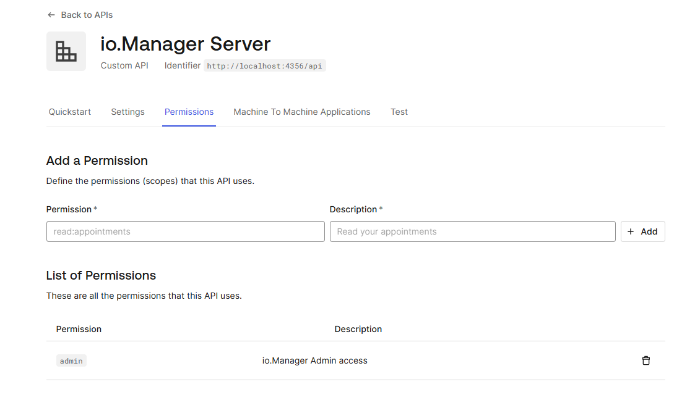

# io.Manager Auth0 Example

This example demonstrates how to setup a io.Manager instance to use Auth0 authentication (OAuth2 & OIDC).

## Prerequisites

### Database

io.Manager requires a database to connect to - this example uses MongoDB, but you can use any other of the supported databases. You will need to either have a local instance or setup a remote database to connect to. For more information visit our Documentation page on the subject: https://docs.interop.io/manager/databases/overview/index.html

### License

**io.Manager** requires a license key to operate. To acquire a license key, contact us at `sales@interop.io`.

# Auth0 Setup

### Create an Auth0 API

- In your Auth0 admin panel go to the **Applications** => **APIs** => **Create API**
- Put `http://localhost:4356/api` as the identifier
- Navigate to the **Settings** tab of the API
- Scroll down and check the **Allow Offline Access** checkbox
- Go to the **RBAC Settings** section and enable both **Enable RBAC** and **Add Permissions in the Access Token**
- Scroll down and click **Save**
- In the **Permission** tab of the API, add a permission called `admin` with a description `io.Manager Admin access`. The **Permission** tab should look like this:
  

### Create an Auth0 Application

- In your Auth0 admin panel go to the **Applications** => **Applications** => **Create Application**
- Give it a name, select **Single Page Web Applications** and hit **Create**
- In the **Settings** tab of the API
  - Copy **Client ID**, **Domain** for later use.
- Scroll to **Application URIs** and fill out the URLs
  - Set **Allowed Callback URLs** to `http://localhost:3000/admin/callback`
  - Set **Allowed Logout URLs** to `http://localhost:3000/admin/logout`
  - Set **Allowed Web Origins** to `http://localhost:3000`
  - Click **Save Changes**

### Assign the "admin" permission to your user

- In your Auth0 admin panel go to the **User Management** => **Users**
- Select yor user
- Navigate to the **Permissions** tab
- Click on **Assign Permissions**
- Select the correct API and permission
- Click **Add Permission**

# How to run

### io.Manager

- Navigate to the `io-manager-server` directory.

- Open `src/index.ts` and look for the `TODO` comments.

- Run the following commands to install the npm packages and start the server:

```sh

npm install

npm audit fix

npm run start

```

### io.Manager Admin UI

- Navigate to the `io-manager-admin-ui` directory.

- Open `src/main.tsx` and fill out the Auth0 client options. Look for the `TODO` comments.

- Run the following commands to install the npm packages and start the application:

```sh

npm install

npm audit fix

npm run start

```

- The Admin UI can be found at http://localhost:3000/admin

# io.Connect Desktop configuration

### Configure io.Connect Desktop to connect to io.Manager

To configure io.Connect Desktop to connect to io.Manager, add the following configuration in `system.json`:

```json
{
  // other configuration above
  // copy from here....
  "server": {
    "enabled": true,
    "url": "http://localhost:4356/api"
  }
  // ...to here
}
```

This will add the Server as an additional application store. If you want the io.Manager Server to be the only app store, set the "appStores" top-level key to an empty array.

This will also instruct io.Connect Desktop to store Layouts and Application Preferences on the io.Manager Server.

### Configure io.Connect Desktop to use the Auth0 sign-in page

To configure io.Connect Desktop to use the Auth0 sign-in page add the following configuration in `system.json`:

```json
{
  // other configuration above
  // copy from here....
  "ssoAuth": {
    "authController": "sso",
    "options": {
      "url": "http://localhost:3000/gd",
      "keepAlive": true,
      "window": {
        "width": 540,
        "height": 660,
        "mode": "flat"
      }
    }
  }
  // ...to here
}
```
