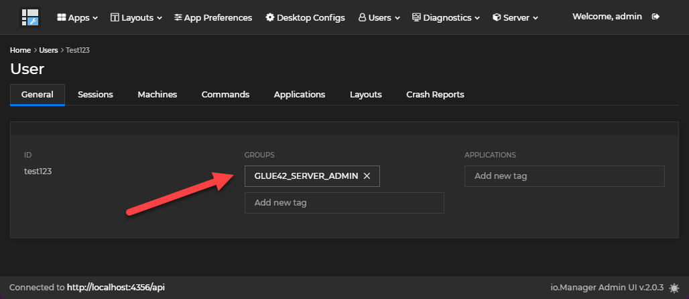

# io.Manager Basic Auth Example

This example demonstrates how to setup a io.Manager instance to use Basic authentication

## Prerequisites

_**Setup MongoDB or another database**_

io.Manager requires a database to connect to - this example uses MongoDB, but you can use any other of the supported databases. You will need to either have a local instance or setup a remote database to connect to. For more information visit our Documentation page on the subject: https://docs.interop.io/manager/databases/overview/index.html

_**Setup access to interop.io Artifactory**_

Before you begin you need to add _.npmrc_ files with the following content into _io-manager-server_ and _io-manager-admin-ui_ directories (placeholders can be filled in after setting up JFrog account)

```sh
@interopio:registry=https://glue42.jfrog.io/artifactory/api/npm/default-npm-virtual/
//glue42.jfrog.io/artifactory/api/npm/:_auth=<COPY_FROM_JFROG_SETUP>
//glue42.jfrog.io/artifactory/api/npm/default-npm-virtual/:username=<COPY_FROM_JFROG_SETUP>
//glue42.jfrog.io/artifactory/api/npm/default-npm-virtual/:email=<COPY_FROM_JFROG_SETUP>
//glue42.jfrog.io/artifactory/api/npm/default-npm-virtual/:always-auth=true
```

# How to run

### io.Manager

- Navigate to the `io-manager-server` directory.

- Run the following commands to install the npm packages and start the server:

```sh

npm install

npm run start

```

### io.Manager Admin UI

- Navigate to the `io-manager-admin-ui` directory.

- Run the following commands to install the npm packages and start the application:

```sh

npm install

npm run start

```

- The Admin UI can be found at http://localhost:8080/admin

- Use username `admin` and password `admin` to login.

- You can create new users by navigating to **Users** => **All users** => **Add User**

- To give the newly created user permissions to use the Admin UI, click on the user and assign it to the `GLUE42_SERVER_ADMIN` group.

- The user page should look like this: 

# io.Connect Desktop configuration

### Configure io.Connect Desktop to connect to io.Manager

To configure io.Connect Desktop to connect to io.Manager, add the following configuration in `system.json`:

```json
{
  // other configuration above
  // copy from here....
  "server": {
    "enabled": true,
    "url": "http://localhost:4356/api"
  }
  // ...to here
}
```

This will add the Server as an additional application store. If you want the io.Manager Server to be the only app store, set the "appStores" top-level key to an empty array.

This will also instruct io.Connect Desktop to store Layouts and Application Preferences on the io.Manager Server.

### Configure io.Connect Desktop to use the basic auth sign-in page

To configure io.Connect Desktop to use the basic auth sign-in page add the following configuration in `system.json`:

```json
{
  // other configuration above
  // copy from here....
  "ssoAuth": {
    "authController": "sso",
    "options": {
      "url": "http://localhost:8080/?gd",
      "keepAlive": true,
      "window": {
        "width": 540,
        "height": 660,
        "mode": "flat"
      }
    }
  }
  // ...to here
}
```
